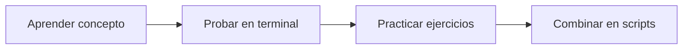

:::homework{id="5.0" title="Examen: Terminal, Bash y Sistemas Operativos" due="2026-02-03" points="10"}

Examen en clase sobre los módulos 4 (Terminal) y 5 (Bash).

**Temas:**
- Sistemas Operativos, Terminal y Bash

:::

# Módulo 5: Bash - El Lenguaje


En el módulo anterior aprendiste a usar la terminal para ejecutar comandos. Ahora vamos un paso más allá: **Bash no es solo una forma de ejecutar comandos, es un lenguaje de programación completo**.

## ¿Qué aprenderás?

Este módulo te enseñará las características de Bash como lenguaje:

- **Variables** - Almacenar y manipular datos
- **Variables de entorno** - Configuración del sistema
- **Entrada/Salida** - stdin, stdout, stderr
- **Expansión y sustitución** - El poder del `$`
- **Scripting básico** - Automatizar tareas

## Filosofía: Terminal Primero



**Primero practicarás cada concepto directamente en la terminal.** Solo al final escribiremos scripts que combinan todo lo aprendido.

## Contenido

1. **[Bash como Lenguaje](./01_bash_como_lenguaje.md)**
   - Más que comandos: un lenguaje completo
   - Modo interactivo vs scripts
   - Comentarios

2. **[Variables](./02_variables.md)**
   - Crear y usar variables
   - `$VAR` vs `${VAR}`
   - Comillas simples vs dobles

3. **[Variables de Entorno](./03_variables_entorno.md)**
   - `$PATH`, `$HOME`, `$USER`
   - `export` y subprocesos
   - `.bashrc` y configuración

4. **[Entrada y Salida](./04_entrada_salida.md)**
   - stdin, stdout, stderr
   - Redirección (`>`, `<`, `2>`)
   - El comando `read`

5. **[Expansión y Sustitución](./05_expansion_sustitucion.md)**
   - `$(comando)` - ejecutar y capturar
   - `$((matemáticas))` - aritmética
   - `${VAR:-default}` - valores por defecto

6. **[Scripting Básico](./06_scripting_basico.md)**
   - Crear y ejecutar scripts
   - Condicionales y loops
   - Script completo de ejemplo

---

## Diferencia con el Módulo 04

| Módulo 04: Terminal | Módulo 05: Bash |
|---------------------|-----------------|
| Ejecutar comandos | Programar con comandos |
| `ls`, `cd`, `cp` | Variables, lógica, automatización |
| Uso interactivo básico | Bash como lenguaje |
| Comandos individuales | Combinar comandos en scripts |

---

## El Símbolo `$` - Tu Nuevo Mejor Amigo

En este módulo verás mucho el símbolo `$`. Es la clave de Bash:

| Sintaxis | Qué hace | Ejemplo |
|----------|----------|---------|
| `$VAR` | Lee una variable | `echo $HOME` |
| `${VAR}` | Lee variable (seguro) | `echo ${USER}` |
| `$(cmd)` | Ejecuta y captura | `echo $(date)` |
| `$((expr))` | Calcula matemáticas | `echo $((2+2))` |

No te preocupes si no lo entiendes ahora - lo practicarás mucho.

---

## Antes de Empezar

Asegúrate de tener acceso a una terminal Bash:

```bash
# Verifica qué shell usas
echo $SHELL

# Debería mostrar /bin/bash o /bin/zsh
# Ambos funcionan para este módulo
```

> **Nota:** Si usas Zsh (default en macOS), los comandos funcionan igual. Las diferencias son mínimas para lo que cubriremos.
