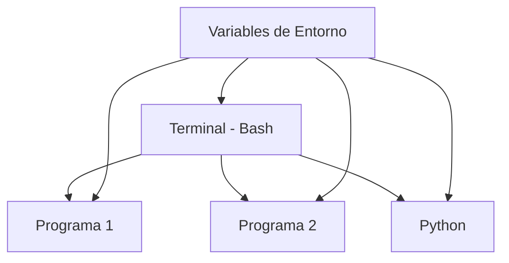

# Variables de Entorno


Las **variables de entorno** son variables especiales que configuran cómo funciona tu sistema y los programas que ejecutas.

---

## ¿Qué son las Variables de Entorno?

Son variables que:
- Existen para **todos los programas** que ejecutas
- Configuran el comportamiento del sistema
- Se heredan de proceso padre a proceso hijo



---

## Variables de Entorno vs Variables Normales

| Tipo | Alcance | Ejemplo |
|------|---------|---------|
| Variable normal | Solo en el shell actual | `mi_var="algo"` |
| Variable de entorno | Shell + todos los programas hijos | `export MI_VAR="algo"` |

```bash
# Variable normal - solo existe aquí
mi_variable="hola"

# Variable de entorno - disponible para programas hijos
export MI_VARIABLE_ENV="hola"
```

---

## Ver Variables de Entorno

### Ver todas: `env` o `printenv`

```bash
# Ver todas las variables de entorno
env

# O también
printenv

# Ver con paginación
env | less
```

### Ver una específica

```bash
# Imprimir una variable
echo $HOME
echo $PATH
echo $USER

# O usar printenv
printenv HOME
printenv PATH
```

:::exercise{title="Explorar tus variables de entorno" difficulty="1"}

```bash
# ¿Cuántas variables de entorno tienes?
env | wc -l

# Busca variables interesantes
env | grep -i user
env | grep -i home
env | grep -i shell

# Las más importantes
echo "Usuario: $USER"
echo "Home: $HOME"
echo "Shell: $SHELL"
echo "Path: $PATH"
```

:::

---

## Variables de Entorno Importantes

### `$PATH` - La más importante

Define **dónde busca Bash los comandos**:

```bash
echo $PATH
# /usr/local/bin:/usr/bin:/bin:/usr/local/sbin:/usr/sbin
```

Son directorios separados por `:`. Cuando escribes `ls`, Bash busca en cada directorio hasta encontrarlo.

```bash
# ¿Dónde está el comando ls?
which ls
# /usr/bin/ls

# Está en uno de los directorios de $PATH
```

### `$HOME` - Tu directorio personal

```bash
echo $HOME
# /home/tu_usuario

# Es equivalente a ~
cd $HOME
cd ~       # Lo mismo
```

### `$USER` - Tu nombre de usuario

```bash
echo $USER
# tu_usuario

echo "Hola, $USER"
# Hola, tu_usuario
```

### `$SHELL` - Tu shell

```bash
echo $SHELL
# /bin/bash  o  /bin/zsh
```

### `$PWD` - Directorio actual

```bash
echo $PWD
# /home/tu_usuario/proyectos

cd /tmp
echo $PWD
# /tmp
```

### `$EDITOR` - Editor por defecto

```bash
echo $EDITOR
# vim  o  nano  o  (vacío)

# Si está vacío, puedes definirlo
export EDITOR=nano
```

### Tabla de Variables Comunes

| Variable | Descripción |
|----------|-------------|
| `$PATH` | Directorios donde buscar comandos |
| `$HOME` | Tu directorio home |
| `$USER` | Tu nombre de usuario |
| `$SHELL` | Shell actual |
| `$PWD` | Directorio de trabajo actual |
| `$OLDPWD` | Directorio anterior |
| `$EDITOR` | Editor de texto por defecto |
| `$LANG` | Idioma/locale del sistema |
| `$TERM` | Tipo de terminal |
| `$HOSTNAME` | Nombre de la máquina |

:::exercise{title="Conocer tu sistema" difficulty="1"}

```bash
# Completa esta información de tu sistema
echo "=== MI SISTEMA ==="
echo "Usuario: $USER"
echo "Hostname: $HOSTNAME"
echo "Home: $HOME"
echo "Shell: $SHELL"
echo "Editor: $EDITOR"
echo "Idioma: $LANG"
echo "Terminal: $TERM"
```

:::

---

## `export` - Crear Variables de Entorno

### Sin export vs Con export

```bash
# Variable normal (solo en este shell)
MI_VAR="hola"

# Ejecuta un subshell
bash -c 'echo $MI_VAR'
# (vacío - el subshell no la ve)

# Ahora con export
export MI_VAR="hola"

# Ejecuta un subshell
bash -c 'echo $MI_VAR'
# hola (ahora sí la ve)
```

### Dos formas de exportar

```bash
# Forma 1: export después
MI_VAR="valor"
export MI_VAR

# Forma 2: export directo
export MI_VAR="valor"
```

:::exercise{title="Diferencia entre export y no export" difficulty="2"}

```bash
# Sin export
SECRETA="sin_export"
bash -c 'echo "Secreta: $SECRETA"'
# ¿Qué imprime?

# Con export
export PUBLICA="con_export"
bash -c 'echo "Publica: $PUBLICA"'
# ¿Qué imprime?

# Python también puede leerlas
export MI_VARIABLE="hola_python"
python3 -c 'import os; print(os.environ.get("MI_VARIABLE"))'
```

:::

---

## Modificar `$PATH`

A veces necesitas agregar directorios a `$PATH`:

### Agregar al final

```bash
# Ver PATH actual
echo $PATH

# Agregar un directorio al final
export PATH="$PATH:/nuevo/directorio"

# Verificar
echo $PATH
```

### Agregar al inicio (mayor prioridad)

```bash
# Agregar al inicio (se busca primero)
export PATH="/nuevo/directorio:$PATH"
```

:::exercise{title="Modificar PATH temporalmente" difficulty="2"}

```bash
# Crea un directorio para scripts
mkdir -p ~/mis_scripts

# Agrega a PATH
export PATH="$PATH:$HOME/mis_scripts"

# Verifica
echo $PATH | tr ':' '\n' | tail -3

# Ahora cualquier script en ~/mis_scripts se puede ejecutar desde cualquier lugar
```

:::

---

## Archivos de Configuración

Las variables de entorno se pierden al cerrar la terminal. Para hacerlas **permanentes**, se agregan a archivos de configuración.

### ¿Qué archivo usar?

| Archivo | Cuándo se ejecuta |
|---------|-------------------|
| `~/.bashrc` | Cada vez que abres una terminal interactiva (Bash) |
| `~/.bash_profile` | Al iniciar sesión (login shells) |
| `~/.profile` | Al iniciar sesión (más general) |
| `~/.zshrc` | Cada vez que abres terminal (Zsh/macOS) |

### Regla práctica

- **Linux/WSL2 con Bash**: Usa `~/.bashrc`
- **macOS con Zsh**: Usa `~/.zshrc`

### Ver contenido

```bash
# Ver tu .bashrc
cat ~/.bashrc

# O con less para archivos largos
less ~/.bashrc
```

### Agregar variable permanente

```bash
# Agregar al final de .bashrc
echo 'export MI_VARIABLE="valor_permanente"' >> ~/.bashrc

# Recargar para que tome efecto
source ~/.bashrc

# Verificar
echo $MI_VARIABLE
```

:::exercise{title="Explorar tu .bashrc" difficulty="2"}

```bash
# ¿Tienes un .bashrc?
ls -la ~/.bashrc

# Ver las primeras 20 líneas
head -20 ~/.bashrc

# Buscar exports existentes
grep "export" ~/.bashrc

# Buscar aliases
grep "alias" ~/.bashrc
```

:::

---

## Variables de Entorno en la Práctica

### Para Python

```bash
# Configurar dónde Python busca módulos
export PYTHONPATH="/mi/ruta/modulos:$PYTHONPATH"

# Verificar desde Python
python3 -c 'import sys; print(sys.path)'
```

### Para editores

```bash
# Definir editor por defecto
export EDITOR=nano
export VISUAL=nano

# Ahora git y otros programas usarán nano
```

### Para proyectos

```bash
# Variables para tu proyecto
export PROJECT_HOME="$HOME/proyectos/mi_app"
export DATABASE_URL="localhost:5432"

# Usarlas
cd $PROJECT_HOME
echo "Conectando a $DATABASE_URL"
```

---

## Ejercicios Integrales

:::exercise{title="Configurar entorno de desarrollo" difficulty="2"}

```bash
# 1. Crea variables para tu proyecto
export PROYECTO="mi_app"
export PROYECTO_DIR="$HOME/proyectos/$PROYECTO"
export PROYECTO_ENV="desarrollo"

# 2. Verifica
echo "Proyecto: $PROYECTO"
echo "Directorio: $PROYECTO_DIR"
echo "Ambiente: $PROYECTO_ENV"

# 3. Crea el directorio si no existe
mkdir -p $PROYECTO_DIR
ls -la $PROYECTO_DIR
```

:::

:::exercise{title="Agregar directorio a PATH" difficulty="3"}

```bash
# 1. Crea un directorio para scripts personales
mkdir -p ~/bin

# 2. Crea un script simple
echo '#!/bin/bash
echo "Hola desde mi script!"' > ~/bin/saludo

# 3. Hazlo ejecutable
chmod +x ~/bin/saludo

# 4. Agrega ~/bin a PATH
export PATH="$PATH:$HOME/bin"

# 5. Prueba ejecutar desde cualquier lugar
cd /tmp
saludo
# Debería imprimir: Hola desde mi script!
```

:::

:::exercise{title="Ver herencia de variables" difficulty="3"}

```bash
# 1. Variable sin exportar
LOCAL="soy_local"

# 2. Variable exportada
export GLOBAL="soy_global"

# 3. Crea un script para probar
cat << 'EOF' > /tmp/test_vars.sh
#!/bin/bash
echo "LOCAL: $LOCAL"
echo "GLOBAL: $GLOBAL"
EOF

chmod +x /tmp/test_vars.sh

# 4. Ejecuta y observa
/tmp/test_vars.sh
# ¿Cuál variable ve el script?
```

:::

---

## Resumen

| Concepto | Descripción |
|----------|-------------|
| Variable de entorno | Variable disponible para todos los procesos hijos |
| `env` / `printenv` | Ver todas las variables de entorno |
| `export VAR=valor` | Crear/exportar variable de entorno |
| `$PATH` | Dónde buscar comandos |
| `~/.bashrc` | Archivo de configuración (Bash) |
| `source ~/.bashrc` | Recargar configuración |

---

> **Siguiente:** Ahora veremos **entrada y salida** - stdin, stdout, stderr y cómo manipular el flujo de datos.
