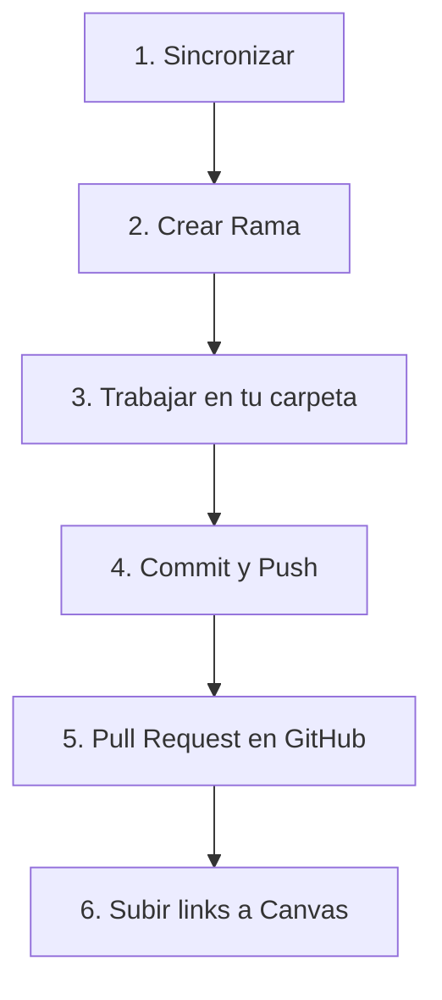

# Flujo de Trabajo para Entregar Tareas

Este documento describe el ciclo de vida completo para trabajar en una tarea, desde la sincronización inicial hasta la entrega final mediante un Pull Request.

**Todo se hace desde la terminal, manualmente.**

---

## Resumen del Flujo



| Paso | Acción | Comando principal |
|------|--------|-------------------|
| 1 | Sincronizar con upstream | `git pull upstream main` |
| 2 | Crear rama de tarea | `git checkout -b tarea-X` |
| 3 | Trabajar | Editar archivos en `estudiantes/tu_usuario/` |
| 4 | Subir cambios | `git add`, `git commit`, `git push` |
| 5 | Crear PR | En GitHub (web) |
| 6 | Canvas | Subir 2 links a la tarea |

---

## Paso 1: Actualizar tu repositorio (Sincronización)

### Configuración Previa (Solo una vez)
Si es la primera vez que haces esto, necesitas decirle a Git cuál es el repositorio del profesor.
```bash
git remote add upstream git@github.com:{org}/{repo-name}.git
```
Verifica que tengas `origin` (tu repo) y `upstream` (mi repo):
```bash
git remote -v
```

### Rutina Diaria
Antes de empezar cualquier tarea nueva, debes asegurarte de que tu copia local tiene las últimas diapositivas y ejercicios del profesor.

1.  Abre tu terminal y navega a la carpeta de tu repositorio:
    ```bash
    cd [ruta_a_tu_repositorio]
    ```
2.  Muévete a la rama principal:
    ```bash
    git checkout main
    ```
3.  Trae los cambios del profesor (`upstream`) y mézclalos con tu `main`:
    ```bash
    git pull upstream main
    ```
4.  Actualiza tu copia en la nube (`origin`) para que también esté al día:
    ```bash
    git push origin main
    ```

*Ahora tu `main` es idéntico al `main` del profesor.*

---

## Paso 2: Crear una rama para la tarea

Nunca trabajes directamente en `main`. Crea una rama aislada para tu tarea.

1.  Crea la rama y cámbiate a ella en un solo paso:
    ```bash
    git checkout -b [nombre-rama-tarea]
    ```
    *Ejemplo:* `git checkout -b tarea-1-intro`

2.  Verifica que estás en la rama correcta:
    ```bash
    git status
    ```
    *Debe decir: `On branch tarea-1-intro`*

---

## Paso 3: Trabajar en tu carpeta asignada

> **⚠️ REGLA DE ORO:** Solo puedes modificar archivos dentro de `estudiantes/[tu_usuario_de_github]/`. Si tocas algo fuera de ahí, tu tarea será rechazada automáticamente.

1.  **Navega a tu carpeta personal.** Es vital que te muevas a tu carpeta antes de empezar.
    ```bash
    # Reemplaza 'usuario' con TU usuario de github
    cd estudiantes/usuario
    ```

2.  **Verifica dónde estás.**
    ```bash
    pwd
    ```
    *Deberías ver algo que termina en `.../estudiantes/tu-usuario`.*

3.  **Trabaja:**
    *   Crea archivos nuevos.
    *   Si creas una carpeta nueva y está vacía, git la ignorará. Para que git la detecte, crea un archivo vacío llamado `.gitkeep` dentro:
        ```bash
        touch carpeta-nueva/.gitkeep
        ```
    *   Resuelve los ejercicios o copia el código de la clase a tu carpeta.

---

## Paso 4: Guardar cambios (Commit)

Una vez que terminaste una parte del trabajo:

1.  **Revisa qué archivos modificaste.** Esto te ayuda a evitar subir archivos basura.
    ```bash
    git status
    ```
    *Deberías ver tus archivos en rojo.*

2.  **Agrega los archivos.**
    *   **Peligro:** `git add .` agrega TODO lo que hay en la carpeta actual. Úsalo solo si estás seguro de que estás dentro de tu carpeta personal y no hay archivos basura.
    *   **Mejor opción:** Agrega archivos o carpetas específicas:
        ```bash
        git add archivo.py
        # O para una carpeta entera
        git add mi-carpeta/
        ```

3.  **Guarda la "foto" de tu trabajo (Commit).**
    ```bash
    git commit -m "Descripción clara de lo que hice"
    ```
    *Ejemplo:* `git commit -m "Terminé el ejercicio 1 de python"`

---

## Paso 5: Subir tu rama a GitHub (Push)

Ahora subiremos tu rama `tarea-1-intro` a **TU** cuenta de GitHub (conocida como `origin`).
Recuerda: No estás subiendo al repo del profesor, estás subiendo a tu Fork.

1.  Ejecuta el push de la rama específica:
    ```bash
    git push origin [nombre-rama-tarea]
    ```
    *Ejemplo:* `git push origin tarea-1-intro`

---

## Paso 6: Crear el Pull Request (PR)

Aquí es donde oficialmente entregas tu tarea al profesor.

1.  Ve a la página de **TU Fork** en GitHub (`https://github.com/TU_USUARIO/NOMBRE_DEL_FORK`).
2.  GitHub suele ser inteligente y te mostrará un recuadro amarillo diciendo "Compare & pull request" con tu rama reciente.
    *   Si no aparece, ve a la pestaña "Pull requests" -> "New pull request".
    *   Busca la opción que dice "compare across forks".
3.  **Configura la comparación (MUY IMPORTANTE):**

    ```
    base: sonder-art/fdd_p26 ← compare: tu-usuario/tu-fork
              main                    tarea-X
    ```

    *   **Base repository:** `sonder-art/fdd_p26` (Repo del profesor)
    *   **Base branch:** `main`
    *   **Head repository:** `[tu-usuario]/[tu-fork]` (Tu repositorio)
    *   **Compare branch:** `[nombre-rama-tarea]` (La rama donde trabajaste)
    
    *⚠️ Error común: No uses tu `main` en el "compare branch". Debes seleccionar la rama específica de tu tarea.*

4.  **Título:** `[Tarea X] Tu Nombre - Título Breve`
5.  **Descripción:** Explica brevemente qué hiciste.
6.  Dale click a **Create Pull Request**.
7.  **Copia la URL del PR** - la necesitarás para Canvas.

---

## Paso 7: Subir a Canvas (OBLIGATORIO)

**El Pull Request NO es suficiente.** También debes entregar en Canvas.

### ¿Qué subir a Canvas?

Debes subir **DOS links** a la tarea correspondiente en Canvas:

| Link | Ejemplo | ¿Dónde lo encuentro? |
|------|---------|----------------------|
| **1. URL del Pull Request** | `https://github.com/sonder-art/fdd_p26/pull/42` | La URL de tu PR después de crearlo |
| **2. URL de tu archivo/carpeta** | `https://github.com/tu-usuario/tu-fork/tree/main/estudiantes/tu_usuario/tarea-X` | Navegando a tu carpeta en GitHub |

### ¿Por qué los dos?

- El **PR** es donde se revisa y aprueba tu código
- El **link directo** permite verificar rápidamente tu trabajo sin buscar en el PR
- Si hay errores en uno, el otro sirve de respaldo

### Formato en Canvas

En el campo de texto de la tarea en Canvas, pega ambos links:

```
Pull Request: https://github.com/sonder-art/fdd_p26/pull/42
Archivos: https://github.com/mi-usuario/fdd_p26/tree/main/estudiantes/mi_usuario/certificaciones
```

> **⚠️ IMPORTANTE:** Si solo subes el PR pero no los links a Canvas (o viceversa), la tarea se considera **incompleta**.

---

## Paso 8: Limpieza (Post-Entrega)

Una vez que tu tarea fue aceptada (merge) por el profesor.

1.  Regresa a tu `main` local:
    ```bash
    git checkout main
    ```
2.  Trae los cambios nuevos:
    ```bash
    git pull upstream main
    ```
3.  Sincroniza tu `main` en la nube:
    ```bash
    git push origin main
    ```
4.  (Opcional) Borra la rama de la tarea que ya entregaste:
    ```bash
    git branch -d tarea-1-intro
    ```
